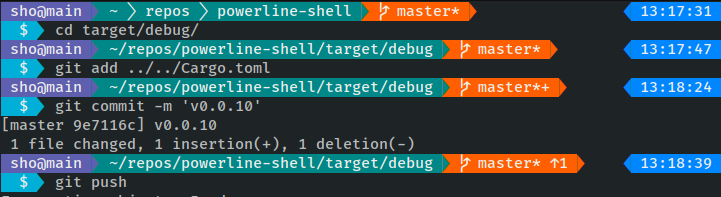

# messa

[](https://github.com/shosatojp/messa/actions/workflows/ci.yml)

- Width flexible shell prompt
- Configure with yaml
- Supports ssh, git, kubernetes, datetime



## Install

### 1. Install `messa`

- statically linked single binary from [here](https://github.com/shosatojp/messa/releases/latest)
- or Use `cargo`

    ```sh
    cargo install messa
    ```

### 2. Append following code to your `.bashrc`

```sh
export PATH="$HOME/.cargo/bin:$PATH"
function create_prompt(){
    PS1=$(messa --error $? --width $COLUMNS --user $USER --host $HOSTNAME -c $HOME/.messa.yaml)
}
export PROMPT_COMMAND="create_prompt;$PROMPT_COMMAND"
```

### 3. Setup config

```sh
wget -O ~/.messa.yaml https://raw.githubusercontent.com/shosatojp/messa/master/.messa.yaml
```

### 4. Reload your shell

```sh
. ~/.bashrc
```

## Build

```sh
cargo build
```
