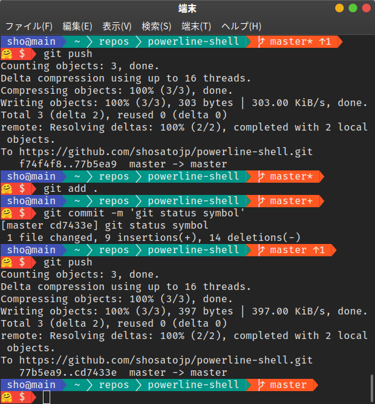

# PowerLine-Shell for Bash

create powerline prompt with **no dependency**.



### unadded


### uncommited


### unpushed


### unadded & unpushed


## Install

1. place `pl.sh` as you like
2. append following code to your `.bashrc`

```sh
source $HOME/pl.sh # path to your `pl.sh` or link
export PROMPT_COMMAND=plsh_create_ps1
```
