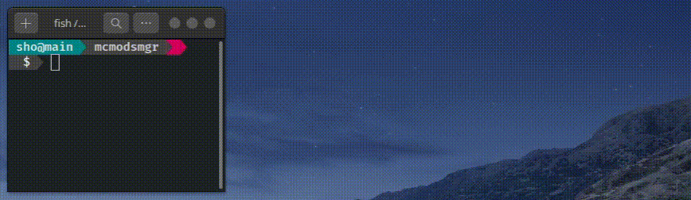

# messa

[](https://github.com/shosatojp/messa/actions/workflows/ci.yml)

- Width flexible shell prompt
- Fast

    |normal directory|git directory|
    |---|---|
    |1.1 ms ± 0.2 ms|5.2 ms ± 0.1ms|

    > measured with [hyperfine](https://github.com/sharkdp/hyperfine)

- Configure with yaml
- Supports ssh, git, kubernetes, datetime




## Install

### 0. Requirements

- C Compiler
  - `gcc`
- `pkg-config`
- OpenSSL Development Package
  - Ubuntu/Debian: `libssl-dev`
  - Fedora: `openssl-devel`

```sh
# ubuntu
sudo apt-get install -y gcc pkg-config libssl-dev
```

### 1. Install `messa`

- statically linked single binary from [here](https://github.com/shosatojp/messa/releases/latest)
    ```sh
    install -D -m 755 <(curl -L https://github.com/shosatojp/messa/releases/download/v2.1.0/messa) .local/bin/messa
    ```
    
    > You may need to modify PATH

- or Use `cargo`

    ```sh
    cargo install messa
    ```

### 2. Append following code to your shell config file

- **Bash**

    ```sh
    # ~/.bashrc
    export PATH="$HOME/.cargo/bin:$PATH"
    function create_prompt(){
        PS1=$(messa --error $? --width $COLUMNS --user $USER --host $HOSTNAME --shell bash)
    }
    export PROMPT_COMMAND="create_prompt;$PROMPT_COMMAND"
    ```

- **Zsh**

    ```sh
    # ~/.zshrc
    export PATH="$HOME/.cargo/bin:$PATH"
    function create_prompt() {
        PS1=$(messa --error $? --width $COLUMNS --user $USER --host $HOSTNAME --shell zsh)
    }
    precmd_functions+=(create_prompt)
    ```

- **Fish**

    ```sh
    # ~/.config/fish/config.fish
    function fish_prompt
        messa --error $status --width $COLUMNS --user $USER --host $HOSTNAME --shell fish
    end
    ```

- **Nushell** [🔗](https://www.nushell.sh/)

    ```sh
    # command in nushell
    config set prompt "messa --error 0 --width (tput cols) --user $nu.env.USER --host (hostname) --shell fish"
    ```

### 3. Setup config

```sh
wget -O ~/.messa.yaml https://raw.githubusercontent.com/shosatojp/messa/master/.messa.yaml
```

### 4. Reload your shell

```sh
. ~/.bashrc
```

## Build

```sh
cargo build
```

## Related projects

- [`powerline-shell`](https://github.com/b-ryan/powerline-shell) (Python)
- [`powerline-go`](https://github.com/justjanne/powerline-go) (Go)
